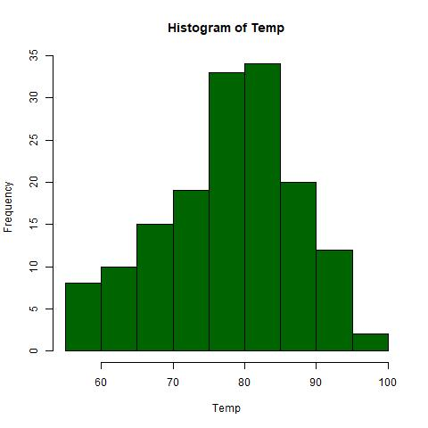
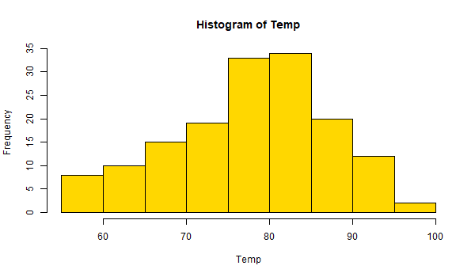
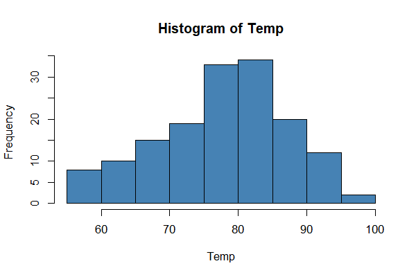
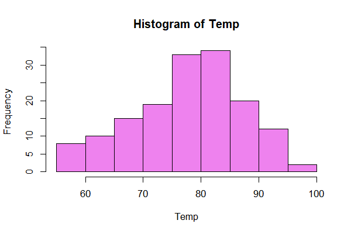

```{r packages, include = F, eval = T}
hook_source <- knitr::knit_hooks$get('source')
knitr::knit_hooks$set(source = function(x, options) {
  x <- stringr::str_replace(x, "^[[:blank:]]?([^*].+?)[[:blank:]]*#<<[[:blank:]]*$", "*\\1")
  hook_source(x, options)
})

library(tidyverse)
library(skimr)
library(janitor)
library(DT)
library(here)
library(kableExtra)
library(knitr)
library(titanic)

```
```{css, echo=F}
.code-bg-red .remark-code, .code-bg-red .remark-code * {
 background-color:red!important;
}
```


# Script file

--
R script?

--

While you can run/execute **r code** using `R console` with ease.

It is time consuming. 

Each time you have to re-enter a command to execute it.

--

* Be calm, we have solution that is `R script`

--

A script is simply a text file containing a set of commands and comments. The script can be saved and used later to re-execute the saved commands. The script can also be edited so you can execute a modified version of the commands.


---

# Creating R Script

Create new script file: File -> New File -> R Script

--


--

Find detailed description [HERE](http://mercury.webster.edu/aleshunas/R_learning_infrastructure/R%20scripts.html)


---

class: inverse, center, middle

background-image: url("images/data-visualization.jpg")
background-size: cover
# Plotting


[Image:BoldBI](https://www.boldbi.com/blog/data-visualization-importance-and-benefits)

---


# Visualization

**Data visualization** is the process to transform the information (data) into a visual presentation for example graph.

--

Visualisation / Plotting is one of greatest strength of `R`

--

Why `visualisation/Plotting`?

--

An image speaks louder than words

--

Data visualizations make data easier for the human brain to understand

--

visualization also makes it easier to detect patterns, trends, and outliers in groups of data

--

Good data .color[visualizations] should place meaning into complicated datasets so that their message is clear and concise.

--

<ru-blockquote>According to Tableau, “[data visualization is] one of the most useful professional skills to develop. The better you can convey your points visually, the better you can leverage that information.”</ru-blockquote>


---

class: center, middle, inverse

# Ingredients for plotting

--

.left[Data]

Materials to visualise that is data. No data no visualisation!

--

.left[Mapping: Contextual relationship]

Mapping depends on what YOU want to show!


---
# Data

--

Import

--

See last lecture for importing external data

--

## Mapping 

--

We will learn!

--
A basic graph 

--

```{r, echo=FALSE, fig.align='center'}
data("cars")
```
```{r, fig.height=3, dev='svg'}
plot(cars$speed, cars$dist, pch = 19, col = 'red', las = 1, xlab="speed", ylab="Distance", main = "Speed Vs Distance")
```

---

# Plotting- Setting

### We will use inbuild data sets in `R`

--

### To view available datasets in `R` Type `data()` and execute 

--

### We will primarily use `data(cars)`

--

### Most used function for plotting in `R` is `plot()`

--

.center[]

---

# Data-Cars

```{r}
data(cars)
```
--

### Examining data

--

Do you remember? `head()` ; `tail()` ; `nrow()` 

--

.pull-left[

```{r, eval=TRUE}
head(cars, 2)
tail(cars, 2) 
```
]

--

.pull-right[

```{r}
ncol(cars)
str(cars)
```
]

---
# Let's start- `Plot()`

`data(cars)` contains two variables `speed` and `distance`

--

### First plot 

Plotting speed and distance

--
.pull-left[

```{r, fig.height= 4, fig.width= 5,fig.align='center'}
plot(cars$speed,cars$dist)
```
]

--
.pull-right[

* Here, `cars$speed` is for `x-axis` and `cars$dist` is for `y-axis`

* In `cars$speed`, `cars` is name of the data file and `speed` is variable name

* `plot()` is command to plot


]

---

# Let's start- `Plot()`


### Second plot 

--

```{r, fig.height= 4, fig.width= 7, fig.align='center'}
x <- seq(-pi,pi,0.1)
plot(x, sin(x))
```


--

* Here `x` is for `x-axis` (a generated data using `seq` command )

* `sin(x)` is for `y-axis` 

---

# Let's start- `Plot()`

### Adding label and Title 

```{r, eval=F}
plot(cars$speed, cars$dist,
     xlab = "Speed", ylab = "Distance", main = "Speed Vs Distance" ) #<<
```
```{r, echo=FALSE, fig.height= 4, fig.width= 7, fig.align='center'}
plot(cars$speed, cars$dist,
     xlab = "Speed", ylab = "Distance",  main = "Speed Vs Distance") 
```

--

* Here to add the label, we have added the highlighted codes. 

* Names of the label should always be in `""`

---

# Let's start- `Plot()`

### Changing Color and Plot Type

* We can change the plot type with the argument `type`

.pull-left[

```{r, eval=FALSE}
"p" - points
"l" - lines
"b" - both points and lines
"c" - empty points joined by lines
"o" - overplotted points and lines
"s" and "S" - stair steps
"h" - histogram-like vertical lines
"n" - does not produce any points or lines
```


]

.pull-right[

```{r, fig.height= 4, fig.width= 5, fig.align='center'}
plot(x, sin(x),
main="The Sine Function",
ylab="sin(x)",
type="l" ) #<<
```

]

---
# Let's start- `Plot()`

### Changing Color and Plot Type

* Similarly, we can define the colors using `col="color name"`

--


```{r, eval=F}
plot(cars$speed, cars$dist,
     xlab = "Speed", ylab = "Distance", main = "Speed Vs Distance",
     col="red" ) #<<
```
```{r, echo=FALSE, fig.height= 4, fig.width= 7, fig.align='center'}
plot(cars$speed, cars$dist,
     xlab = "Speed", ylab = "Distance",  main = "Speed Vs Distance", col="red") 
```
--

* See the highlighted part of the code

---

# Let's start- `Plot()`

### Overlaying Plots

--

* Do YOU remember the function/command? `seq` -- we will use HERE to generate the variables `X, Y, t`

```{r, echo=FALSE}
X <- seq(1, 10, by = 1)
Y <- seq(10, 1, by=-1)
t <- seq(from=1,by=0.5, length.out = 10)
```

--

* plotting

--

.pull-left[
 
```{r, eval=FALSE}
plot(t, X,
     main="Overlaying Graphs",
     ylab="",
     type="l",
     col="blue")
lines(t, Y, col="red") #<<
legend("left", #<<
       c("X","Y"), #<<
       fill=c("blue","red") #<<
)
```
]

--

.pull-right[
 
```{r, echo=FALSE, fig.align='center',fig.height= 4, fig.width= 6}
plot(t, X,
     main="Overlaying Graphs",
     ylab="X&Y",
     type="l",
     col="blue")
lines(t, Y, col="red") 
legend("left", 
       c("X","Y"), 
       fill=c("blue","red") 
)
```
--

* Checkout `?plot()` and `?legend`

]

---

# Some Baisc Graphs

### R Bar Plot

--

* Let's assume `AR` contains data of .red[average rainfall] in a day of a week.
```{r, echo=FALSE}
AR <- c( 12, 15, 11, 16, 18, 15, 14 )
```


```{r, fig.height= 4, fig.align='center',fig.width= 6}
barplot(AR)
```

--

* There are many other parameters can be added to `barplot()`

* Use `?barplot()` to explore

---

# Some Baisc Graphs

### R Bar Plot
--

* Some of the parameters are added here. 

--

```{r, fig.height= 6, fig.align='center',fig.width= 8, eval=FALSE}
barplot(AR,
main = "Average rainfall in a Day", #<<
xlab = "Centimeters (cm)", #<<
ylab = "Day", #<<
names.arg = c("Mon", "Tues", "Wed", "Thu", "Fri", "Sat", "Sun"), #<<
border="blue", #<<
col="red", #<<
density=20, #<<
horiz = TRUE, #<<
cex.names = .8)#To change the size of label  #<< 
```

--
* See the highlighted codes

* Output in .red[next slide]

---

# Some Baisc Graphs

### R Bar Plot
--

* Some of the parameters are added here. 

--

```{r, fig.height= 6, fig.align='center',fig.width= 8, echo=FALSE}

barplot(AR,
main = "Per day average rainfall in a week",
xlab = "Centimeters (cm)",
ylab = "Day",
names.arg = c("Mon", "Tues", "Wed", "Thu", "Fri", "Sat", "Sun"),
border="blue",
col="red",
density=20,
horiz = TRUE,
cex.names = .8)
```

---

# Some Baisc Graphs

### Bar Plot of Categorical Data

--

* For example marks out of 20 of ten students in Math is in vector `MM`

```{r, echo=FALSE}
MM <- c(17,16,18,17,18,19,18,16,18,18)
```

```{r, echo=FALSE}
print(MM)
```

--

* Simple bar plot

--

```{r, echo=FALSE, fig.height=4, fig.width=7, fig.align='center'}
barplot(MM,
main="Marks of 10 Students",
xlab="Marks",
ylab="Count",
border="blue",
col="red",
density=10
)
```
* Does it serve pupose? -- No


---

# Some Baisc Graphs

### Bar Plot of Categorical Data

.small[
* First convert the data into categorical representation using `table()`

* Check out `?table()`
]

.code60[

```{r}
table(MM)
```
]

--
.pull-left[

```{r, eval=FALSE, fig.height=3, fig.width=4}
barplot(table(MM), #<<
main="Marks of 10 Students",
xlab="Marks",
ylab="Count",
border="blue",
col="red",
density=10
)
```

]

--
.pull-right[

```{r, echo=FALSE, fig.height=4, fig.width=5, fig.align='center'}
barplot(table(MM),
main="Marks of 10 Students",
xlab="Marks",
ylab="Count",
border="blue",
col="red",
density=10
)
```
]

---

# Some Baisc Graphs

### Bar Plot of Categorical Data

#### Some more Bar plot

```{r, echo=FALSE}
train <- titanic_train
data <- data.frame(train$Pclass,train$Survived)
data <- table(data)
data <- data.matrix(data)
titanic_surv<- t(data)

```
--

.code70[

```{r, }
print(titanic_surv)
```
]

.font60[

* Here, 1, 2, and 3 represents 1st, 2nd and 3rd class in the train

* 0 and 1 is for the passenger did not survived and survived respectively in the Titanic mishap

]

.code60[

```{r, eval=FALSE}
barplot(titanic_surv, #<<
        main = "Survival of Each Class",
        xlab = "Class",
        ylab = "No of Passenger",
        col = c("red","green")
)
legend("topleft",
       c("Not survived","Survived"),
       fill = c("red","green")
)
```

]

---

# Some Baisc Graphs

### Bar Plot of Categorical Data

#### Some more Bar plot


```{r, echo=FALSE, fig.align='center', fig.width=5, fig.height=5}
v1 <- c(1:3)
v2 <- c("1st", "2nd", "3rd")

barplot(titanic_surv, 
        main = "Survival of Each Class",
        xlab = "Class",
        ylab = "No of Passenger",
        col = c("red","green"),
        xaxt ="n"
)
legend("topleft",
       c("Not survived","Survived"),
       fill = c("red","green")
)
axis(side=1, at=v1, labels=v2 )

```

---
# Some Baisc Graphs

### Histogram-`hist()`

--
.font60[
*  Histogram is a visual representation of the distribution of a dataset

* We will use the `data(AirPassengers)` in built in `R`

* Explore the function `hist()` using `?hist()`

* A Basic Histogram
]

.font80[
.left-column[

* put the name of your dataset in between the parentheses like `hist(AirPassengers)`

* Histogram for a specific variable can be drawn as `hist(datasetName$VariableName)`


]
]

--

.right-column[
.code70[
```{r, echo=FALSE}
data("AirPassengers")

```
```{r, fig.align='center',fig.height=4,fig.width=6}
hist(AirPassengers)
```
]
]


---

# Some Baisc Graphs

### Histogram-`hist()`

* Other parameters of `hist()`

.code70[

.pull-left[

```{r, eval=FALSE}
hist(AirPassengers, 
     main="Histogram for Air Passengers", 
     xlab="Passengers", 
     border="blue", 
     col="green",
     xlim=c(100,700), #<<
     las=1, #<<
     breaks=5) #<<
```
]

.pull-right[

```{r, echo=FALSE, fig.align='center',fig.height=5,fig.width=6}
hist(AirPassengers, 
     main="Histogram for Air Passengers", 
     xlab="Passengers", 
     border="blue", 
     col="green",
     xlim=c(100,700),
     las=1, 
     breaks=5)
```

]
]

--

.font80[

* `xlim=c()` & `ylim=c()` fixes the range of `X` and `Y` axes

* Inside `c()` sets starting and ending points

* `las=1` rotates the label of `Y-axis` Checkout `?las`

* `breaks` is for the size/width of `Histogram BINS` Chechout `?breaks`

]

---

# Some Baisc Graphs

### Pie Chart-`Pie Chart`

--

* Pie chart is drawn using the `pie()` function in `R` programming

* This function takes in a vector of .red[non-negative] numbers.

* Basic Syntax of is `pie(x, labels, radius, main, col, clockwise)`

.content-box-blue[
.font80[

* .red[x] is a vector containing the numeric values used in the pie chart.

* .red[labels] is used to give description to the slices.

* .red[radius] indicates the radius of the circle of the pie chart.(value between −1 and +1).

* .red[main] indicates the title of the chart.

* .red[col] indicates the color palette.

* .red[clockwise] is a logical value indicating if the slices are drawn clockwise or anti clockwise.
]
]

* Explore `?pie()`

---

# Some Baisc Graphs

### Pie Chart-`Pie Chart`

```{r, echo=FALSE}
scores <- data.frame("Subjects" = c("Math", "Eng", "Urdu", "Sc", "Soc."), "Obt.Marks"=c(70, 80, 60, 80, 90), stringsAsFactors = FALSE)
```


--
.font70[

*  In `pie()`, `scores$Obt.Marks` is the vector of positive numbers for which `pie-chart` is drawn

* `scores$Subjects` is the labels 

* Note: `scores$Subjects` shows that `Subjects` variable has been selected from`scores` dataset
]


.code60[
.pull-left[

* `Pie Chart`

```{r, fig.height= 5, fig.width= 5, fig.align='center'}
pie(scores$Obt.Marks, scores$Subjects)
```

]
]

.code70[
.pull-right[

* Data

```{r}
print(scores)
```

]
]

---

.font80[
# Some Baisc Graphs

### Pie Chart-`Pie Chart`

### Other parameters 
]

.code70[


```{r, eval=FALSE}
piepercent<- round(100*(scores$Obt.Marks)/sum((scores$Obt.Marks)), 1) # %age calculation #<<
pie(scores$Obt.Marks, labels = piepercent, # Labels #<<
    main = "Scores pie chart", # Title of chart #<<
    col = rainbow(length(scores$Obt.Marks))) # Color of chart #<<
legend("topright", # legend position #<<
       scores$Subjects, # legend labels #<<
       cex = 0.8, # size of legend texts #<<
   fill = rainbow(length(scores$Obt.Marks))) # legend color #<<


```

]


```{r, echo=FALSE, fig.height=4, fig.width=4,fig.align='center'}
piepercent<- round(100*(scores$Obt.Marks)/sum((scores$Obt.Marks)), 1) 

pie(scores$Obt.Marks, labels = piepercent, main = "Scores pie chart(%age Share)",col = rainbow(length(scores$Obt.Marks)))
legend("topright", scores$Subjects, cex = 0.8,
   fill = rainbow(length(scores$Obt.Marks)))


```

---

# Some Baisc Graphs

## Scatterplot Matrix 

* In case of more than two variables and to find the correlation between one variable versus the remaining ones

* we use scatterplot matrix. `pairs()` function creates matrices of scatterplots.

* `pairs(formula, data)`

* We will use `data(mtcars)` available within `R`; explor `?mtcars`

```{r, echo=FALSE}

data("mtcars")
head(mtcars, 2)
```
```{r, eval=FALSE}
pairs(~wt+mpg+disp+cyl,data = mtcars,
   main = "Scatterplot Matrix")

```

* Plot in the next slide

---

# Some Baisc Graphs

## Scatterplot Matrix 


```{r, echo=FALSE, fig.align='center'}
pairs(~wt+mpg+disp+cyl,data = mtcars,
   main = "Scatterplot Matrix")

```

* Plot in the next slide

---

# Multiple Plots 

.font80[

## R Function `par()`

* For drawing multiple graphs in a single plot- use `par()`

* Checkout `?par()`
]
--
.font80[
### Let's take an example 
]
--
.font80[
* For drawing two graphs in one plot 

```{r, echo=FALSE}
scores <- data.frame("Subjects" = c("Math", "Eng", "Urdu", "Sc", "Soc."), "Obt.Marks"=c(70, 80, 60, 80, 90), stringsAsFactors = FALSE)
```

```{r, eval=FALSE}
par(mfrow=c(1,2))    # set the plotting area into a 1*2 array (1 Row and 2 Col) 
barplot(scores$Obt.Marks, names.arg = scores$Subjects, main="Barplot", las=2) # Bar plot #<<
pie(scores$Obt.Marks, scores$Subjects, main="Piechart", radius=1) # Pie Chart #<<
```
* See the graph in next slide
]
--

* Here parameter `mfrow` used to specify the number of subplot we need.

--

* It takes in a vector of form `c(m, n)` which divides the given plot into `m*n` array of subplots. 

--
 
* For the above example, to plot the two graphs side by side, we have `m=1` and `n=2`. 

---

# Multiple Plots 


## R Function `par()`- Explore it for more control parameters

```{r, echo=FALSE, fig.align='center', fig.width= 9}
par(mfrow=c(1,2))    # set the plotting area into a 1*2 array (1 Row and 2 Col) 
barplot(scores$Obt.Marks, names.arg = scores$Subjects, main="Barplot", ylim = c(0,100), las=2) # Bar plot #<<
pie(scores$Obt.Marks, scores$Subjects, main="Piechart", radius=1) # Pie Chart #<<
```


---

# Saving / Exporting Graph

* All types of graphs `(bar plot, pie chart, histogram)` etc. can be saved.

* Graphs can be saved as bitmap image( i.e. .png, jpeg, tiff etc) which are fixed size

* Graphs can be also saved as vector image (.pdf, .eps) which are easily resizable

* We will use the `temperature` column of built-in dataset `airquality`

```{r, echo=FALSE}
Temp <- airquality$Temp
```

---

# Saving / Exporting Graph

## Saving as `.jpeg` 
.code110[
.pull-left[

```{r, eval=FALSE}
jpeg(file="saving_plot1.jpeg") 
# File name
hist(Temp, col="darkgreen")
dev.off() # TO call off
```
```{r, echo=FALSE, results='hide'}
jpeg(file="saving_plot1.jpeg")
hist(Temp, col="darkgreen")
dev.off()
```
]

]


.pull-right[

.center[Saved Graph]

.center[


]

]

--

* Image will be saved in `working/default directory`

* we need to call the function `dev.off()` after all the plotting, to save the file and return control to the screen

* The resolution of the image by default will be $480\times480$ pixel.

---

# Saving / Exporting Graph

## Saving as `.png` 

.pull-left[

```{r, eval=FALSE}

png(file= "F:/MEGAsync/AMU class Jan-May 2020/ECM 2073-R/Lecture 7/Lecture7/saving_plot2.png",
width=600, height=350) #<<
hist(Temp, col="gold")
dev.off()
```
```{r, echo=FALSE,results='hide'}
png(file= "saving_plot2.png",
width=600, height=350)
hist(Temp, col="gold")
dev.off()
```


]


.pull-right[

.center[Saved Graph]


.center[


]]

* You can specify the full path tp save the image at desired plcae (as above)

* You can also specify the resolution at desired level using arguments `width` and `height`

---

# Saving / Exporting Graph

## Saving as `.bmp` 

* Size of the plot can be specified in different units such as in inch, cm or mm with the argument `units` and ppi with `res`.

* The following code saves a bmp file of size `6x4 inch` and `100 ppi`.

.pull-left[

.code110[
```{r, eval=FALSE}

bmp(file="saving_plot3.bmp",
width=6, height=4, units="in", res=100)
hist(Temp, col="steelblue")
dev.off()
```
]

```{r, echo=FALSE,results='hide'}
bmp(file="saving_plot3.bmp",
width=6, height=4, units="in", res=100)
hist(Temp, col="steelblue")
dev.off()
```


]


.pull-right[

.center[Saved Graph]


.center[


]]

---

# Saving / Exporting Graph

## Saving as `.pdf` 


```{r, eval=FALSE}

bmp(file="saving_plot4.pdf",
width=6, height=4, units="in", res=100)
hist(Temp, col="violet")
dev.off()
```


```{r, echo=FALSE,results='hide'}
bmp(file="saving_plot4.pdf",
width=6, height=4, units="in", res=100)
hist(Temp, col="violet")
dev.off()
```

--

.center[Saved Graph]

.center[


]


---

# Plotting in `R`


--

* This presentation is not exhaustive.

--

* Adopt learning by doing approach

--

* Make use of `Google` and `R Documentation`

--

* It was about basic `R` plotting

--

* Plotting has become more exciting and easy using `package-ggplot2` in `R`

--

* What is `package`? 
--
See the next slide!

-- 

```{r, echo=FALSE, fig.height= 3, fig.width = 6, fig.align='center'}
library(ggplot2)
theme_set(theme_classic())

g <- ggplot(mpg, aes(cty))
g + geom_density(aes(fill=factor(cyl)), alpha=0.8) + 
  labs(title="A plot with `ggplot`", 
       subtitle="City Mileage Grouped by Number of cylinders",
       caption="Source: mpg",
       x="City Mileage",
       fill="# Cylinders")
```

---

# What is `packages`

## Packages

Packages add functionality that is not present in base R. 

Strength `R` lies in .red[packages]

--

.center[


.small[Courtesy [Modern Dive](http://moderndive.com/2-getting-started.html#packages)]

]


---
class: inverse, middle, center
background-image: url(https://upload.wikimedia.org/wikipedia/commons/3/39/Naruto_Shiki_Fujin.svg)
background-size: contain

# .red[THANKS]

